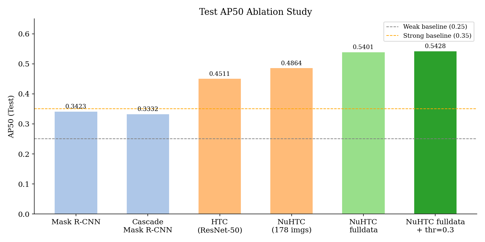

# VRDL HW3 — Cell Instance Segmentation

**Student ID:** 314540079  
**Name:** Yeftha Joshua Ezekiel  
**Public Test AP50:** 0.5428  

## Introduction

Instance segmentation of four cell types (class1–class4) in colored histopathology images, evaluated by AP50 on CodaBench. This work develops a progressive model pipeline:

**Mask R-CNN → Cascade Mask R-CNN → HTC → NuHTC (final)**

The final model is [NuHTC](https://github.com/boyden/NuHTC) (Li et al., Medical Image Analysis 2025), built on Hybrid Task Cascade with a Swin-Tiny backbone and Watershed Proposal Network (WSPN), fine-tuned on all 209 training images.

| Model | Test AP50 |
|-------|-----------|
| Mask R-CNN | 0.3423 |
| Cascade Mask R-CNN | 0.3332 |
| HTC (ResNet-50) | 0.4511 |
| NuHTC Swin-Tiny (178 imgs) | 0.4864 |
| NuHTC fulldata (epoch 30) | 0.5401 |
| **NuHTC fulldata + thr=0.3** | **0.5428** |

## Environment Setup

```bash
# Clone repo and submodules
git clone https://github.com/ArkZ10/vrdl_hw3.git
cd vrdl_hw3

# Create conda environment
conda create -n nuhtc python=3.10 -y
conda activate nuhtc

# Install PyTorch (CUDA 11.6)
pip install torch==1.13.1+cu116 torchvision==0.14.1+cu116 \
    --extra-index-url https://download.pytorch.org/whl/cu116

# Install mmcv and mmdet
pip install mmcv-full==1.7.2 -f https://download.openmmlab.com/mmcv/dist/cu116/torch1.13/index.html
pip install mmdet==2.18.0

# Install remaining dependencies
pip install -r requirements.txt
```

## Usage

### 1. Prepare dataset

Download the dataset and place it under `datasets/hw3/`:
```
datasets/hw3/
├── train/          # 209 training image folders
├── test_release/   # 101 test images
└── test_image_name_to_ids.json
```

### 2. Preprocess

```bash
# Convert .tif masks to COCO JSON annotations
python preprocessing/prepare_coco.py \
    --data_root datasets/hw3 \
    --output_dir datasets/hw3/annotations

# Generate semantic segmentation maps (required for HTC/NuHTC)
python preprocessing/generate_semantic_seg.py
```

### 3. Training

```bash
# Example: train NuHTC on all data
CUDA_VISIBLE_DEVICES=0 python tools/train.py \
    configs/nuhtc/nuhtc_fulldata_hw3.py \
    --cfg-options data.workers_per_gpu=0 \
                  data.samples_per_gpu=2 \
                  log_config.interval=10
```

### 4. Inference

```bash
CUDA_VISIBLE_DEVICES=0 python tools/inference_hw3.py \
    --config configs/nuhtc/nuhtc_fulldata_hw3.py \
    --checkpoint work_dirs/nuhtc_fulldata_hw3/epoch_30.pth \
    --output test-results.json \
    --score-thr 0.3
```

### 5. Evaluate per-class AP50 (validation set)

```bash
# First run inference on val set
python tools/test.py configs/nuhtc/nuhtc_fulldata_hw3.py \
    work_dirs/nuhtc_fulldata_hw3/epoch_30.pth \
    --out val_results.pkl --eval segm \
    --cfg-options data.test.ann_file=datasets/hw3/annotations/val.json \
                  data.test.img_prefix=datasets/hw3/train/

# Convert pkl to json and evaluate
python eval_per_class.py \
    --ann datasets/hw3/annotations/val.json \
    --result val_results.json
```

### 6. Submit to CodaBench

```bash
zip submission.zip test-results.json
```

Upload `submission.zip` to CodaBench and click "Add to Leaderboard".

## Performance Snapshot

Public leaderboard score: **0.5428** (above strong baseline 0.35)


